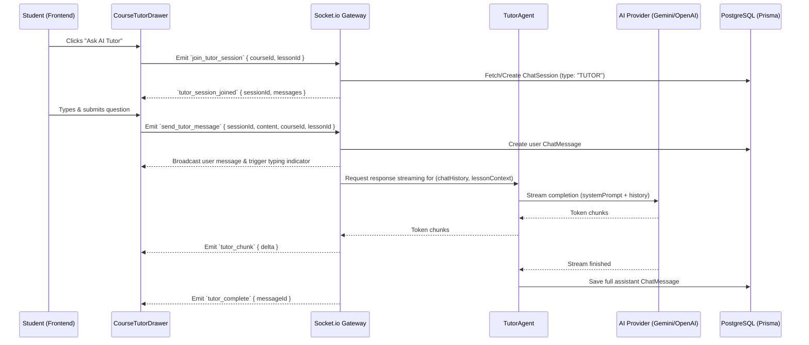

# Live AI Course Tutor Bot - Design Specification

**Date:** 2026-07-23  
**Status:** Approved  
**Topic:** Live AI Course Tutor Bot with Real-time Streaming & Scope Context

---

## 1. Overview & Goals

The **Live AI Course Tutor Bot** is an interactive, real-time AI study assistant embedded in the Marko application. It empowers learners to ask clarifying questions, request real-world code examples, simplify complex concepts, and discuss course topics while reading lessons or reviewing course material.

### Key Capabilities

- **Omnipresent Slide-over UI:** A floating AI Tutor button/drawer accessible on any course or lesson view.
- **Context-Aware Assistance:** Dynamically injects the current course outline and lesson content into the prompt context.
- **Real-Time Token Streaming:** Delivers answers token-by-token using WebSockets (`Socket.io`) and `ChatProvider.stream()`.
- **Persistent Q&A History:** Saves conversation threads per course/lesson in PostgreSQL via `ChatSession` and `ChatMessage` models.

---

## 2. Architecture & Data Flow



---

## 3. Database Schema Updates (`schema.prisma`)

Update `ChatSession` model to support course-linked tutor chat threads:

```prisma
enum ChatSessionType {
  CAPSTONE
  TUTOR
}

model ChatSession {
  id        String          @id @default(cuid())
  title     String?
  type      ChatSessionType @default(TUTOR)
  courseId  String?
  course    Course?         @relation(fields: [courseId], references: [id], onDelete: Cascade)
  userId    String
  user      User            @relation(fields: [userId], references: [id], onDelete: Cascade)
  messages  ChatMessage[]
  createdAt DateTime        @default(now())

  @@index([userId])
  @@index([courseId])
}
```

---

## 4. Backend Service & Agents

### 4.1 Tutor Agent (`backend/src/agents/tutor.agent.ts`)

- Builds system prompt with rules:
    - Role: Friendly, highly knowledgeable AI Course Tutor.
    - Grounding: Ground responses in the provided course title, description, and active lesson content.
    - Tone: Encouraging, concise, uses markdown and formatted code blocks where relevant.
- Calls `getChatProvider(userId)` and streams responses via `provider.stream()`.

### 4.2 Socket Gateway (`backend/src/modules/chat/chat.gateway.ts`)

Add events:

- `join_tutor_session`: Finds existing active tutor `ChatSession` for `(userId, courseId)` or creates a new one. Returns chat history.
- `send_tutor_message`: Persists user message, invokes `TutorAgent.streamTutorTurn()`, emits `tutor_chunk` for each delta, and persists assistant message on completion.

---

## 5. Frontend UI/UX Components

### 5.1 `CourseTutorDrawer.tsx`

- **Location:** Slide-over panel attached to the right side of the screen.
- **Header:** Course/Lesson context badge (e.g., _"Discussing: Lesson 2 - State Management"_), close button, and session clear button.
- **Message List:** Displays student and assistant messages, rendering Markdown via `react-markdown` with syntax-highlighted code blocks.
- **Input Area:** Textarea with keyboard shortcuts (Enter to send, Shift+Enter for newline) and suggested starter chips (_"Explain this simply"_, _"Give an example"_, _"Test my understanding"_).

### 5.2 Floating Tutor Button (`TutorFloatingButton.tsx`)

- Floating Action Button (FAB) anchored in bottom-right corner of course and lesson pages.
- Unread badge indicator and pulse animation on initial lesson load.

---

## 6. Verification Plan

1. **Database Migration:** Run `npx prisma db push` and verify client generation.
2. **WebSocket Integration:** Test opening tutor drawer on a course page, sending a message, verifying live token streaming, and confirming database insertion.
3. **Context Sensitivity:** Verify that opening the drawer on Lesson A vs Lesson B grounds the tutor in the respective lesson's content.
4. **Type Check:** Run `npm run typecheck` across backend and frontend.
